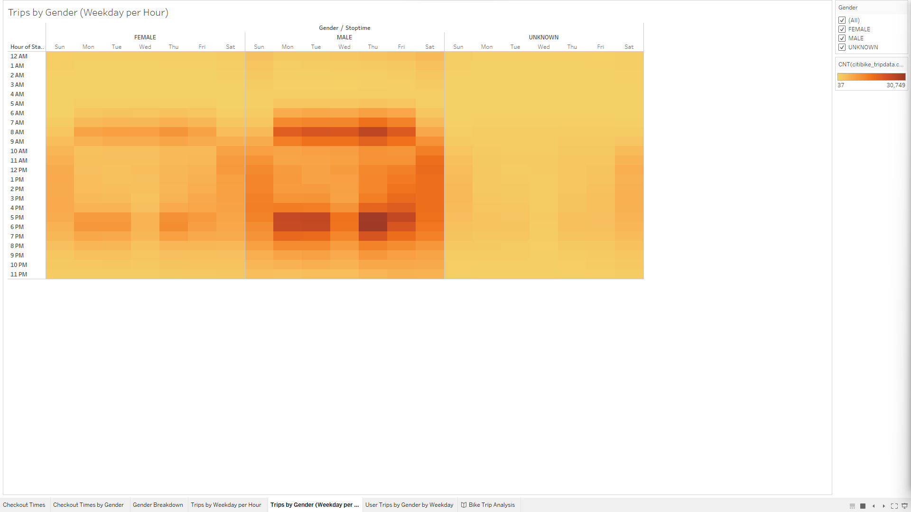

# Analyzing and Visualizing Bikeshare Data
## Overview
Using a solid sample set of rideshare data from New York City, I used Jupyter Notebook, Python / Pandas, and Tableau to extract, tranfer, and load data from August 2019. Understanding this data will help investors make decisions on future bikeshare markets.

## The Data Visualization Process
1.    Select questions. During this step, I considered which results I wanted to share with investors. They wanted to see demographic data, utilization data, and have that visualized over time. Using this information might make deciding whether to expand the bikeshare market to Des Moines, Iowa. 
   
While visualizations such as this one, that depict utilization broken down by gender and time of day are stimulating and valid, there are just that for Manhattan.

2.    Execute independent research. Although Des Moines, Iowa is larger than Manhattan. Information obtained from [comparearea.org](https://www.comparea.org/r128653+r2552485) tells us that Des Moines is roughly four times the size of Manhattan, but has about 1/10th of the population. 
## Results
3.    Craft a Tableau story. The visuals created support investor decision-making. The market in Des Moines may not be primed for bikeshare. Further analysis is required.

[Review the Bikeshare Tableau Analysis and Visualization](https://public.tableau.com/app/profile/scott.mccraney/viz/BikeTripAnalysis_16746214779930/BikeTripAnalysis) 

## Summary
4.    Create a written analysis. 

The data clearly depicts user demographics, bike utilization, total ride times, and when users are riding. Armed with this analysis, understood through the Tableau visualizations, investors will be able to discern whether or not Des Moines is a market worth their time and money. 

Two additional visualizations might seek to geographically depict PROBABLE ride share locations in Des Moines, and better break down the population demographic in Des Moines, as well. Data from NYC is great, but it is just that: a snapshot of information from a city that is about 1,000 miles away. The data might be best represented as foundational, with additional analysis on target markets forthcoming by the team.
